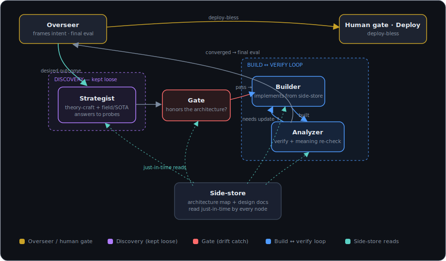

# Resonance Loop

**A disciplined methodology for adding capability to any system without architectural drift.**

<p align="center">
  
</p>

Every addition should *fit* — proven against the architecture, not bolted on. The Resonance Loop is a small set of roles, gates, and disciplines that make "does this belong, and does it actually do what we intended?" a question no change can skip. It runs solo (one person/agent wearing every hat in sequence) or as a multi-agent harness.

It is **not** a build-automation tool. The "loop" is the rigor of how work is dispatched and gated — not push-button automation. It is a **pre-merge fit discipline**: it owns the path to a blessed, verified change and hands off to your project's own versioning, regression checks, and post-deploy monitoring for what runs after.

> **The intent, in one breath: build toward better — simply, and confidently.**
> For every addition: *is this for the purpose, or just for more?*

## Why

Most systems don't rot from one bad decision; they rot from a hundred reasonable-looking bolt-ons, each of which *almost* fit. The Resonance Loop attacks that directly:

- **Reuse before you add.** Most "new" needs already have a seat in what's built. The pathway gate forces the question: does an existing pathway carry this, or do we genuinely need a new one?
- **Question before you build.** Every addition is positioned and interrogated across four axes of meaning *before* a line is written.
- **Both directions.** Forward-write the design, then attack it from the thing's own side. "Works from one angle" is not enough.
- **Observe-first, shadow always.** Build the read-only version, watch real behavior, calibrate, *then* act — against a copy, never the live system, until verified.
- **Two human gates.** Nothing touches the live system until a human blesses the design; nothing ships until a human blesses the deploy.
- **Converge — then ship.** The rigor exists to *earn the confidence to act*, not to defer it. The loop must finish: stop when the thing fits its purpose; the next increment past that serves refinement, not the work. Stop is a feature — and it's recorded up front as a small artifact (mode · *done looks like* · iteration budget) the loop trips on, so "finish" is a step, not a hope.

## Use it as a skill — three modes (slash commands)

This repo ships as a portable agent **skill** with three entry points. Pick your intent up front — it keeps each invocation focused and the pipeline stable:

| Command | Mode | Deploy | Use for |
|---|---|---|---|
| `/resonance-loop` | Full methodology (reference) | — | The complete loop + a worked example |
| `/rl-theory` | Theory / test-bench | **OFF** | Design passes, evaluations, audits, observe-first dry-runs — the rigor without shipping; converges to a named finding |
| `/rl-deploy` | Full CI/CD pipeline | **ON** | Shipping a change into the live system — converge → deploy-bless → apply → validate → feed-forward |

The split is deliberate. `/rl-theory` runs the whole discipline with the deploy stage **disabled** — it stops at a proven finding you hand to `/rl-deploy`. `/rl-deploy` runs the terminal **apply → validate → feed-forward** motion. Same skeleton, different terminus — so you carry only the context the moment needs.

**Install:** copy each skill directory into your agent's skills folder (for Claude Code: `~/.claude/skills/<name>/SKILL.md`, or add this repo as a plugin). The three skills live at [`SKILL.md`](./SKILL.md), [`rl-theory/SKILL.md`](./rl-theory/SKILL.md), and [`rl-deploy/SKILL.md`](./rl-deploy/SKILL.md); each is self-contained and its front-matter `description` tells the agent when to reach for it.

You can also just **read it.** [`SKILL.md`](./SKILL.md) is the concise operating guide; [`METHODOLOGY.md`](./METHODOLOGY.md) is the deep dive with a fully worked example.

## The shape, in one screen

```
discovery (+ field/SOTA)  →  positioning  →  four-axis questioning  →  design + reverse-review
   →  GATE  →  build (shadow / isolated)  →  analyze (verify + meaning re-check)
   →  converge  →  final eval  →  human deploy-bless  →  APPLY (live, reversibly)
   →  VALIDATE (re-run + observe)  →  keep or revert  →  feed the finding forward ↻
```

The **deploy-bless is the act, not the approval** — it triggers apply → validate → feed-forward. A blessed change that never ships is analysis that never built.

A **side-store** (the authoritative context) feeds every step fresh — never relayed down a chain.

**Roles:** Overseer (the *why*, the gates) · Builder (the smallest real increment) · Strategist (discovery + field/SOTA) · Analyzer (the skeptic, two checklists) · Human (two gates).

**The four meaning-axes:** field/SOTA · the thing being built · our understanding · now + tomorrow.

**Definition of done:** *fits + means what was intended + verified clean* — not merely "runs."

## Make it yours (the SPEC slots)

The skeleton is constant; you fill seven slots per project:

| Slot | What it is |
|---|---|
| Laws | The non-negotiable spec the gate checks against |
| Positioning | Where a new addition can live (internal vs interface) |
| Pathway map | The system's integration points + branch-vs-bypass test |
| Side-store | The authoritative context every step reads |
| Gate-test | The concrete pass/reject question |
| Done-criterion | Fits + means-what-intended + verified clean |
| Verify harness | How you watch the built thing behave |

See [`METHODOLOGY.md`](./METHODOLOGY.md) for a worked example (filling the slots for a web service).

## License

[MIT](./LICENSE) — use it, fork it, adapt it, ship it.

## Contributing

Issues and PRs welcome. The methodology is meant to be adapted; if you find a sharper framing or a missing discipline, open a discussion.
